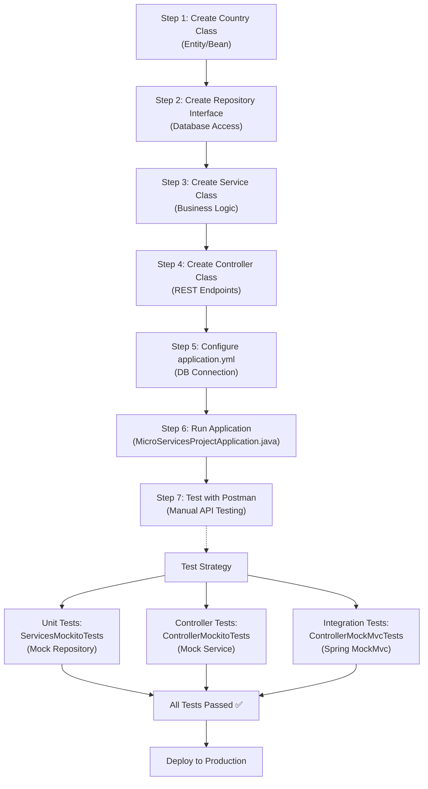
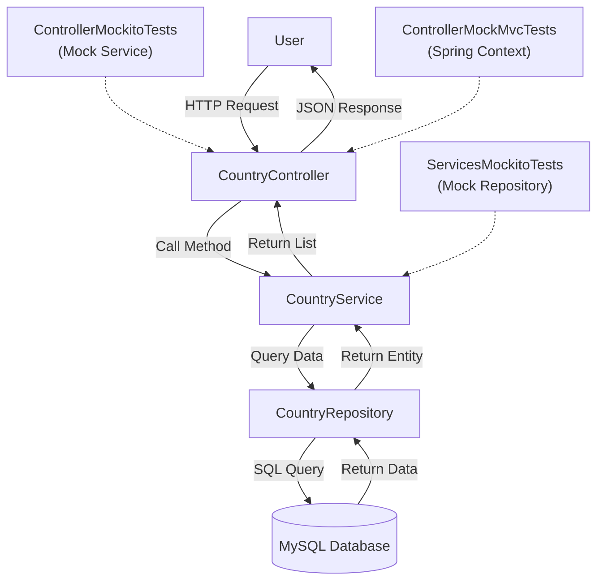

# Country Microservice REST API Testing Project

A simple Spring Boot microservice project demonstrating how to build, test, and verify a Country REST API using **JUnit 5**, **Mockito**, and **MockMvc**. Perfect for freshers and experienced developers!

---

## 📋 Table of Contents
1. [Project Overview](#project-overview)
2. [Architecture Flow](#architecture-flow)
3. [Project Structure](#project-structure)
4. [Setup Instructions](#setup-instructions)
5. [Database Setup](#database-setup)
6. [Running the Application](#running-the-application)
7. [API Testing with Postman](#api-testing-with-postman)
8. [Testing Strategy](#testing-strategy)
9. [Running Tests](#running-tests)
10. [Flowchart](#flowchart)

---

## 🎯 Project Overview

This project demonstrates a **REST Microservice** for managing countries with the following features:

- **Create** a new country
- **Read** all countries or a specific country
- **Update** country details
- **Delete** a country

The project follows best practices:
- ✅ **Layered Architecture** (Controller → Service → Repository)
- ✅ **Unit Testing** with Mockito (Services)
- ✅ **Integration Testing** with MockMvc (Controllers)
- ✅ **Database Testing** with Mock Database

---

## 🏗️ Architecture Flow

```
┌─────────────────────────────────────────────────────────┐
│                   Client (Postman)                      │
└─────────────────────────────────────────────────────────┘
                         ↓ HTTP Request
┌─────────────────────────────────────────────────────────┐
│              CountryController                          │
│  (Handles HTTP requests & responses)                    │
└─────────────────────────────────────────────────────────┘
                         ↓
┌─────────────────────────────────────────────────────────┐
│              CountryService                             │
│  (Business logic & validation)                          │
└─────────────────────────────────────────────────────────┘
                         ↓
┌─────────────────────────────────────────────────────────┐
│              CountryRepository                          │
│  (Database operations)                                  │
└─────────────────────────────────────────────────────────┘
                         ↓
┌─────────────────────────────────────────────────────────┐
│              MySQL Database                             │
│  (Stores country data)                                  │
└─────────────────────────────────────────────────────────┘
```

---

## 📁 Project Structure

```
RestMicroServicesAPITestingProject/
│
├── src/main/java/com/restservices/demo/
│   ├── MicroServicesProjectApplication.java    # Main entry point
│   │
│   ├── models/
│   │   └── Country.java                        # Country entity/bean
│   │
│   ├── controller/
│   │   └── CountryController.java              # REST API endpoints
│   │
│   ├── services/
│   │   └── CountryService.java                 # Business logic
│   │
│   ├── repository/
│   │   └── CountryRepository.java              # Database access
│   │
│   └── resources/
│       └── application.yml                     # Database configuration
│
├── src/test/java/com/restservices/demo/
│   ├── ServicesMockitoTests.java               # Test Service layer
│   ├── ControllerMockitoTests.java             # Test Controller with mocks
│   ├── ControllerMockMvcTests.java             # Test Controller with Spring
│   │
│   └── resources/
│       └── application-test.yml                # Test database config
│
├── pom.xml                                      # Maven dependencies
└── README.md                                    # This file

```

---

## 🚀 Setup Instructions

### Prerequisites
- **Java 17** (or 11)
- **Maven 3.6+** (comes with project via `mvnw`)
- **MySQL Server** running locally
- **Postman** (for API testing)
- **IDE**: IntelliJ IDEA or Eclipse

### Step 1: Clone the Repository
```bash
git clone https://github.com/Rohit1724/RestMicroServicesAPITestingProject.git
cd RestMicroServicesAPITestingProject
```

### Step 2: Install Dependencies
```bash
# Using Maven wrapper (no need to install Maven separately)
./mvnw clean install
```

---

## 🗄️ Database Setup

### Step 1: Create Database
```sql
-- Open MySQL Command Line or MySQL Workbench
-- Create database
CREATE DATABASE country_db;

-- Use the database
USE country_db;

-- Create Country table
CREATE TABLE country (
    id INT AUTO_INCREMENT PRIMARY KEY,
    country_name VARCHAR(100) NOT NULL UNIQUE,
    country_code VARCHAR(3) NOT NULL UNIQUE,
    region VARCHAR(50),
    population BIGINT,
    created_at TIMESTAMP DEFAULT CURRENT_TIMESTAMP
);

-- Insert sample data
INSERT INTO country (country_name, country_code, region, population) VALUES
('India', 'IND', 'Asia', 1400000000),
('United States', 'USA', 'North America', 331000000),
('Brazil', 'BRA', 'South America', 215000000),
('Germany', 'DEU', 'Europe', 83000000),
('Japan', 'JPN', 'Asia', 125000000);
```

### Step 2: Configure Database Connection
Edit `src/main/resources/application.yml`:
```yaml
spring:
  datasource:
    url: jdbc:mysql://localhost:3306/country_db
    username: root
    password: your_password
    driver-class-name: com.mysql.cj.jdbc.Driver
  
  jpa:
    hibernate:
      ddl-auto: update
    show-sql: true
  
  application:
    name: CountryMicroservice

server:
  port: 8080
```

---

## ▶️ Running the Application

### Method 1: From IDE
1. Open `MicroServicesProjectApplication.java`
2. Right-click → Run As → Java Application

### Method 2: From Command Line
```bash
./mvnw spring-boot:run
```

### Expected Output
```
  .   ____          _            __ _ _
 /\\ / ___'_ __ _ _(_)_ __  __ _ \ \ \ \
( ( )\___ | '_ | '_| | '_ \/ _` | \ \ \ \
 \\/  ___)| |_)| | | | | || (_| |  ) ) ) )
  '  |____| .__|_| |_|_| |_|\__, | / / / /
 =========|_|==============|___/=/_/_/_/
 :: Spring Boot ::           (v4.1.0)

2024-01-15 10:30:45.123  INFO 12345 --- [main] c.r.d.MicroServicesProjectApplication   : Started MicroServicesProjectApplication
2024-01-15 10:30:45.456  INFO 12345 --- [main] o.s.b.w.embedded.tomcat.TomcatWebServer  : Tomcat started on port(s): 8080
```

✅ **Server is running!** Visit: `http://localhost:8080`

---

## 📡 API Testing with Postman

### Import Postman Collection
1. Create a new collection named "Country API"
2. Add the following requests:

### 1. Get All Countries
```
GET http://localhost:8080/api/countries

Response:
[
  {
    "id": 1,
    "countryName": "India",
    "countryCode": "IND",
    "region": "Asia",
    "population": 1400000000
  },
  ...
]
```

### 2. Get Country by ID
```
GET http://localhost:8080/api/countries/1

Response:
{
  "id": 1,
  "countryName": "India",
  "countryCode": "IND",
  "region": "Asia",
  "population": 1400000000
}
```

### 3. Create New Country
```
POST http://localhost:8080/api/countries

Headers:
Content-Type: application/json

Body (JSON):
{
  "countryName": "Australia",
  "countryCode": "AUS",
  "region": "Oceania",
  "population": 26000000
}

Response (201 Created):
{
  "id": 6,
  "countryName": "Australia",
  "countryCode": "AUS",
  "region": "Oceania",
  "population": 26000000
}
```

### 4. Update Country
```
PUT http://localhost:8080/api/countries/1

Headers:
Content-Type: application/json

Body (JSON):
{
  "countryName": "India",
  "countryCode": "IND",
  "region": "South Asia",
  "population": 1420000000
}

Response (200 OK):
{
  "id": 1,
  "countryName": "India",
  "countryCode": "IND",
  "region": "South Asia",
  "population": 1420000000
}
```

### 5. Delete Country
```
DELETE http://localhost:8080/api/countries/1

Response (204 No Content): Success
```

---

## 🧪 Testing Strategy

This project uses **3-Layer Testing** approach:

### Layer 1: Service Tests (Unit Tests)
**File**: `ServicesMockitoTests.java`
- Test business logic **without** database
- Mock the repository using Mockito
- Fast execution
- Example:
```java
@Test
void testGetAllCountries() {
    // Arrange
    List<Country> expected = Arrays.asList(new Country(1, "India", ...));
    when(repository.findAll()).thenReturn(expected);
    
    // Act
    List<Country> actual = service.getAllCountries();
    
    // Assert
    assertEquals(expected, actual);
    verify(repository).findAll();
}
```

### Layer 2: Controller Tests with Mocks
**File**: `ControllerMockitoTests.java`
- Test REST API endpoints **without** starting server
- Mock both service and repository
- Verify request/response mapping
- Example:
```java
@Test
void testGetCountries() {
    // Arrange
    List<Country> countries = Arrays.asList(new Country(1, "India", ...));
    when(service.getAllCountries()).thenReturn(countries);
    
    // Act & Assert
    mockMvc.perform(get("/api/countries"))
           .andExpect(status().isOk())
           .andExpect(jsonPath("$[0].countryName").value("India"));
}
```

### Layer 3: Controller Tests with MockMvc
**File**: `ControllerMockMvcTests.java`
- Test full Spring context **without** real database
- Spring Boot automatically creates a mock environment
- Verifies complete request/response cycle
- Example:
```java
@WebMvcTest(CountryController.class)
void testCreateCountry() {
    Country newCountry = new Country(null, "Australia", "AUS", "Oceania", 26000000);
    
    mockMvc.perform(post("/api/countries")
           .contentType(MediaType.APPLICATION_JSON)
           .content(objectMapper.writeValueAsString(newCountry)))
           .andExpect(status().isCreated());
}
```

---

## 🧬 Running Tests

### Run All Tests
```bash
./mvnw test
```

### Run Specific Test Class
```bash
# Run Service tests
./mvnw test -Dtest=ServicesMockitoTests

# Run Controller Mockito tests
./mvnw test -Dtest=ControllerMockitoTests

# Run Controller MockMvc tests
./mvnw test -Dtest=ControllerMockMvcTests
```

### Run Tests with Coverage
```bash
./mvnw test jacoco:report
```

### Run Tests from IDE
1. Right-click on test file
2. Select "Run As" → "JUnit Test"

### Expected Output
```
-------------------------------------------------------
 T E S T S
-------------------------------------------------------
Running com.restservices.demo.ServicesMockitoTests
Tests run: 5, Failures: 0, Skipped: 0, Time elapsed: 0.234 s

Running com.restservices.demo.ControllerMockitoTests
Tests run: 5, Failures: 0, Skipped: 0, Time elapsed: 0.456 s

Running com.restservices.demo.ControllerMockMvcTests
Tests run: 5, Failures: 0, Skipped: 0, Time elapsed: 0.789 s

Results: 15 passed ✅
```

---

## 📊 Flowchart

### Complete Development & Testing Flow



---

## 📚 Key Concepts Explained

### What is Mocking?
- Creating fake objects that simulate real objects
- Allows testing without real database
- Faster & more reliable tests

### What is MockMvc?
- Spring tool to test controllers without running server
- Simulates HTTP requests
- Verifies responses without real network calls

### Test Pyramid
```
        △ Integration Tests (Slow, Few)
       △ △ Component Tests (Medium)
      △ △ △ Unit Tests (Fast, Many)
```

---

## 🔧 Troubleshooting

### Issue: Connection refused to MySQL
```
Error: Communications link failure
Solution: 
1. Ensure MySQL is running
2. Check username/password in application.yml
3. Verify database name is correct
```

### Issue: Tests fail with "Service not found"
```
Error: No qualifying bean of type 'CountryService'
Solution:
1. Ensure @Service annotation is on Service class
2. Check component scan includes your package
3. In tests, use @MockBean or @Mock
```

### Issue: Port 8080 already in use
```
Error: Bind exception
Solution:
1. Kill process: lsof -ti:8080 | xargs kill -9
2. OR change port in application.yml: server.port: 8081
```

---

## 📝 Quick Checklist

- [x] Database created with country table
- [x] MySQL server running
- [x] Maven dependencies installed (`./mvnw clean install`)
- [x] Application running (`./mvnw spring-boot:run`)
- [x] Postman collection created
- [x] API endpoints tested manually
- [x] Unit tests pass (`./mvnw test`)
- [x] All tests green ✅

---

## 🎓 Learning Path (For Freshers)

1. **Day 1**: Understand REST API basics
2. **Day 2**: Learn Spring Boot & Annotations
3. **Day 3**: Build the 3 classes (Entity, Service, Controller)
4. **Day 4**: Set up database & test with Postman
5. **Day 5**: Learn Mockito & write unit tests
6. **Day 6**: Learn MockMvc & integration tests
7. **Day 7**: Review & practice entire flow

---

## 🤝 Contributing

Found an issue? Want to improve?
1. Create a branch: `git checkout -b feature/your-feature`
2. Make changes
3. Push: `git push origin feature/your-feature`
4. Create a Pull Request

---

## 📞 Support & Next Steps

**Need help?**
- Read the [Spring Boot Docs](https://spring.io/projects/spring-boot)
- Check [JUnit 5 Guide](https://junit.org/junit5/)
- Review [Mockito Documentation](https://javadoc.io/doc/org.mockito/mockito-core/latest/org/mockito/Mockito.html)

**What you can enhance:**
- Add authentication/authorization
- Add input validation
- Add custom exceptions
- Add logging
- Add pagination to API
- Deploy to cloud (AWS, Azure, Heroku)

---

**Happy Testing! 🚀**

---

## Flowchart (Mermaid Alternative)


