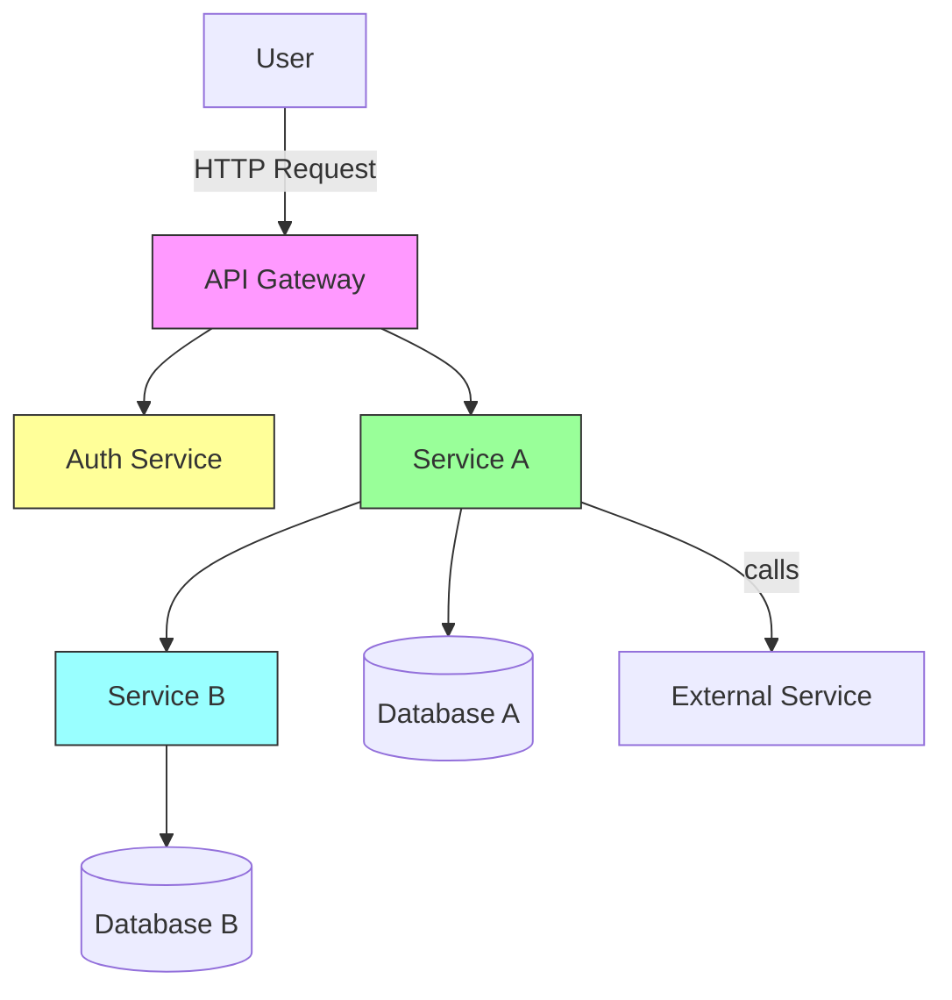

# MicroServicesProject

Rest API & Microservices

Microservices Testing using Spring Boot + JUnit5 + Mockito + MockMvc

---

## Table of Contents

- About
- Prerequisites
- Pre-run (configuration)
- Build & Run
  - Single service
  - All services (Docker Compose)
- Running Tests
  - Unit tests
  - Integration tests
  - Contract tests
- QA Testing: approach & checklist
- Flowchart
- Suggested CI pipeline checks
- Helpful resources

---

## About

This repository contains a set of Java Spring Boot microservices and demonstrates testing approaches for microservices using JUnit 5, Mockito, and MockMvc. The README explains how to run the services, the pre-requisites, and how to approach QA testing for microservices.

---

## Prerequisites

- JDK 11 or 17 (LTS recommended) installed and JAVA_HOME set
- Maven 3.6+ (or the project Maven Wrapper `./mvnw` if present)
- Git
- Docker & Docker Compose (optional, required for containerized runs and some integration tests)
- (Optional) PostgreSQL / MySQL / MongoDB or other database used by services — check each service's configuration

---

## Pre-run (configuration / pre-requests)

Before running services locally, ensure:

1. Clone the repository:

   git clone https://github.com/Rohit1724/MicroServicesProject.git
   cd MicroServicesProject

2. Check each microservice's `application.yml` or `application.properties` for required environment variables. Common examples:

   - SPRING_DATASOURCE_URL
   - SPRING_DATASOURCE_USERNAME
   - SPRING_DATASOURCE_PASSWORD
   - EUREKA_SERVER_URL or CONFIG_SERVER_URL (if using service discovery/config)
   - OAUTH/JWT configuration (if auth is external)

3. If services require a database, either run a local instance (or Docker container) or use Testcontainers during integration tests.

4. If there is a `docker-compose.yml` at repository root (or a `compose` folder), review and start dependent infrastructure via Docker Compose.

---

## Build & Run

Note: Replace `service-name` with the actual microservice folder names in this repository.

Single service (local):

- If project has Maven wrapper:

  ./mvnw -pl service-name clean package
  ./mvnw -pl service-name spring-boot:run

- With installed Maven:

  mvn -pl service-name clean package
  mvn -pl service-name spring-boot:run

All services (Docker Compose):

- If a `docker-compose.yml` exists for local development, start all services and infra:

  docker-compose up --build

- To bring it down:

  docker-compose down

Notes:
- Services can be run on different ports — check each service's `application.yml`.
- Use environment-specific `application-*.yml` or `--spring.profiles.active=dev` as required.

---

## Running Tests

Unit tests (fast, isolated):

- Run all unit tests across the repository:

  mvn test

- Run tests for a single module/service:

  mvn -pl service-name test

Integration tests (use Spring context, MockMvc or Testcontainers):

- Typically run with Maven integration profile or a naming convention (e.g. `*IT`):

  mvn verify -Pintegration

- If integration tests use Testcontainers they will start required containers automatically.

Mocking & MVC tests:

- Use MockMvc for controller-layer tests.
- Use Mockito to mock service/repository dependencies in unit tests.

Contract tests (recommended):

- Implement consumer-driven contract tests (Pact) or Spring Cloud Contract.
- Run contract verification as part of the CI pipeline.

---

## QA Testing: approach & checklist

QA testing for microservices is layered. Here's a practical approach with tools and checkpoints.

1. Test Pyramid (small to large):
   - Unit tests (JUnit5 + Mockito): fast, many tests, isolate classes.
   - Component tests (MockMvc): test controllers and request/response mapping.
   - Integration tests: start parts of the system (Testcontainers) and test interactions with databases and dependent services.
   - Contract tests: ensure provider and consumer compatibility.
   - End-to-end (E2E) tests: run full workflows through API Gateway or UI.

2. Automated checks QA should verify:
   - All unit and integration tests pass on PR.
   - Contract tests pass for any changed API.
   - API schema/Swagger (OpenAPI) generation is correct and up-to-date.
   - Health endpoints (e.g., /actuator/health) report expected statuses.
   - Logs show no WARN/ERROR during startup and tests.
   - Database migrations (Flyway/Liquibase) apply successfully.

3. Manual / Exploratory QA:
   - Validate critical user journeys using Postman or similar.
   - Smoke test the main endpoints (create/read/update/delete flows).
   - Check edge cases, rate limiting, and error responses (4xx/5xx handling).

4. Performance & Load:
   - Run basic performance tests (JMeter, Gatling) for critical endpoints.
   - Test behavior under concurrency and check service degradation strategies.

5. Security & Vulnerability Scans:
   - Static analysis (SpotBugs, SonarQube)
   - Dependency checks (OWASP Dependency-Check, Snyk)
   - Penetration test critical endpoints if required

6. Test Data & Environment:
   - Keep a dedicated QA environment with seeded test data.
   - Use Testcontainers/local docker for local reproducible tests.
   - Avoid coupling tests to production data.

QA Checklist for releasing a microservice change:
- [ ] Unit tests: all green
- [ ] Integration tests: green
- [ ] Contract tests with consumers: green
- [ ] API docs updated (OpenAPI/Swagger)
- [ ] Health checks: OK
- [ ] DB migrations tested
- [ ] Load smoke test passed
- [ ] Security scans run
- [ ] Canary or staged rollout plan in place

---

## Flowchart

Mermaid diagram (GitHub supports Mermaid inside Markdown in many contexts). If your repository viewer doesn't render Mermaid, see the ASCII fallback below.

ASCII fallback:

User -> API Gateway -> Auth Service
                    -> Service A -> Service B -> Database
                                  -> Database A
                                  -> External Service

---

## Suggested CI pipeline checks

- Build (mvn -B -DskipTests=false package)
- Run unit tests (mvn test)
- Run integration tests (mvn verify -Pintegration) or a subset in PRs
- Run contract verification (if using Pact or Spring Cloud Contract)
- Run static analysis & dependency scanning
- Publish artifacts or Docker images on successful merge to main

---

## Helpful resources

- Spring Boot Testing: https://spring.io/guides/gs/testing-web/
- JUnit 5: https://junit.org/junit5/
- Mockito: https://site.mockito.org/
- MockMvc docs: https://docs.spring.io/spring-framework/docs/current/reference/html/testing.html#spring-mvc-test-framework
- Testcontainers: https://www.testcontainers.org/

---

If you'd like, I can:

- Add a repository-specific Docker Compose example if you point out the service folders or the `docker-compose.yml` location.
- Add a Postman collection example and basic test scripts.
- Generate a PNG of the flowchart and add it to the repo.

