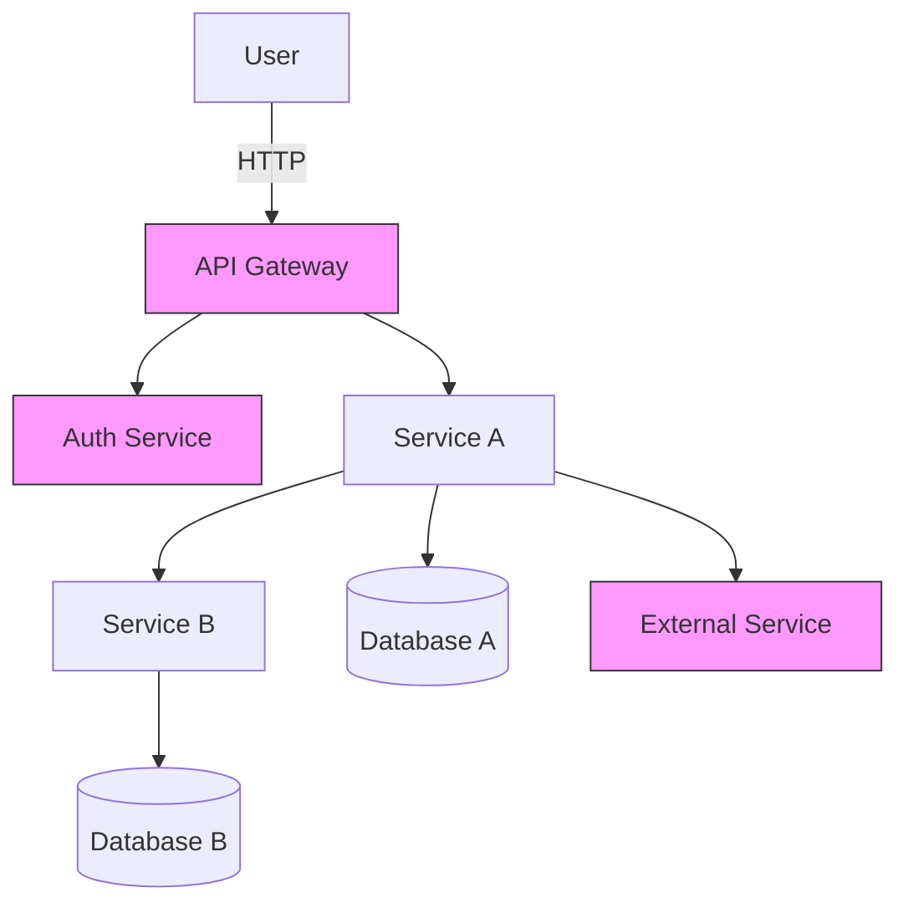

# MicroServicesProject

Welcome — this repository demonstrates a small Spring Boot microservices setup with a focus on testing. This README is written for new developers and freshers: it explains how the project is structured, how to run and test services locally, and how to contribute and QA changes.

---

## Quickstart (for freshers — 10 minutes)

1. Install JDK 11 or 17 and Maven (or use the Maven wrapper `./mvnw`).
2. Clone the repo:

   git clone https://github.com/Rohit1724/MicroServicesProject.git
   cd MicroServicesProject

3. Build the project (runs unit tests):

   ./mvnw clean package

4. Run a single service (replace `<service-folder>` with an actual module folder name):

   cd <service-folder>
   ./mvnw spring-boot:run

5. Open http://localhost:8080/ (check the service's port in `application.yml`).

If you prefer Docker Compose (recommended for running all services and infra):

   docker-compose up --build

---

## What this repo contains (high level)

- Several Java Spring Boot microservice modules (one per folder). Each module is an independent service with its own `application.yml` and tests.
- Tests written using:
  - JUnit 5 for unit and integration tests
  - Mockito for mocking dependencies
  - MockMvc for controller-level tests
  - (Optional) Testcontainers for integration tests that require databases or brokers

---

## Project structure (what to look for as a beginner)

- /service-a - example microservice A (controllers, services, repositories)
- /service-b - example microservice B
- /common - shared DTOs or test utilities (if present)
- pom.xml - parent Maven file (multi-module)
- README.md - this file
- docker-compose.yml - compose file to run services + infra locally (if present)

Tip: Start by opening one service folder, locate `src/main/java` and `src/test/java` to see code and tests.

---

## Prerequisites

- JDK 11 or 17 (set JAVA_HOME)
- Maven 3.6+ (or use `./mvnw` provided)
- Git
- Docker & Docker Compose (optional but recommended)

---

## Running services locally

Run a single service with Maven:

- Build & run from project root (module-aware):

  ./mvnw -pl <service-folder> clean package
  ./mvnw -pl <service-folder> spring-boot:run

- Or run inside the service folder:

  cd <service-folder>
  ./mvnw spring-boot:run

Use `--spring.profiles.active=dev` or set env vars if the service uses different profiles.

Docker Compose (all services + infra):

  docker-compose up --build

Bring everything down:

  docker-compose down

---

## Testing: how to run and what to check (for freshers)

The testing strategy follows the Test Pyramid. As a beginner, learn and run these in order:

1. Unit tests (fast)
   - Run all unit tests:

     ./mvnw test

   - Run tests for one module:

     ./mvnw -pl <service-folder> test

   What to look for:
   - Tests use JUnit 5 annotations: @Test, @BeforeEach
   - Mockito is used to mock dependencies: @Mock, when(...).thenReturn(...)

2. Controller / MockMvc tests (component-level)
   - These verify HTTP request/response mapping without starting the full server.
   - Run with `mvn test` or from IDE (right click test class -> Run).

3. Integration tests (slower)
   - May use Spring context and Testcontainers to start a real DB or broker.
   - Run with:

     ./mvnw verify -Pintegration

   What they validate:
   - DB migrations, repository queries, full request handling with the Spring context.

4. Manual / Exploratory API tests (QA)
   - Use Postman or curl to exercise endpoints.
   - Check health endpoints: /actuator/health and /actuator/metrics

---

## How to QA test microservices (step-by-step checklist for freshers)

1. Smoke tests (after deployment or local run):
   - Can I reach the service endpoints (200/201 responses)?
   - Health checks return UP
   - No WARN/ERROR logs on startup

2. Functional checks:
   - For each CRUD endpoint: create -> read -> update -> delete
   - Validate expected status codes and response payloads
   - Validate input validation and error messages for invalid requests

3. Integration checks:
   - Database writes are persisted and can be read by other service modules that depend on them
   - Message broker events (if any) are produced/consumed correctly

4. Contract tests (if implemented):
   - Ensure provider tests pass for consumer-defined contracts (Pact or Spring Cloud Contract)

5. Non-functional checks (basic):
   - Response times for critical endpoints (are they within expected limits?)
   - Concurrency: basic check with a few simultaneous requests

6. Security checks:
   - Ensure sensitive endpoints require auth and return 401/403 for unauthenticated/unauthorized access
   - Validate input sanitization and error handling

QA Checklist (copyable):
- [ ] Service starts successfully and health endpoint is UP
- [ ] Unit tests: green
- [ ] Integration tests: green
- [ ] Critical API flows tested manually (Postman/curl)
- [ ] Basic load smoke test
- [ ] Logs clean of startup errors

---

## Flowchart (Mermaid)

If GitHub does not render Mermaid, use the ASCII fallback:

User -> API Gateway -> Service A -> Service B -> Databases

---

## Helpful tips for freshers

- Run small changes and tests locally first — make a small code change, run a single unit test.
- Use your IDE's test runner (IntelliJ/Eclipse) to debug tests quickly.
- Add logs with clear context (requestId, userId) to make debugging in local logs easier.
- Learn to read a stack trace: look at the top-most project class in the trace to find the failing code.

Learning path (short):
- Java basics -> Spring Boot basics -> REST controllers -> Spring Data JPA -> Testing with JUnit/Mockito -> MockMvc -> Testcontainers

---

## Contributing & getting help

See CONTRIBUTING.md for a friendly guide on how to contribute, run tests, and open PRs.

---

## Next steps I can take for you

- Add a sample `docker-compose.yml` that wires up two services and a Postgres DB.
- Add a Postman collection with sample requests and basic tests.
- Add a GitHub Actions workflow to run tests on PRs (CI).

If you'd like any of these, tell me which and I'll add them.
