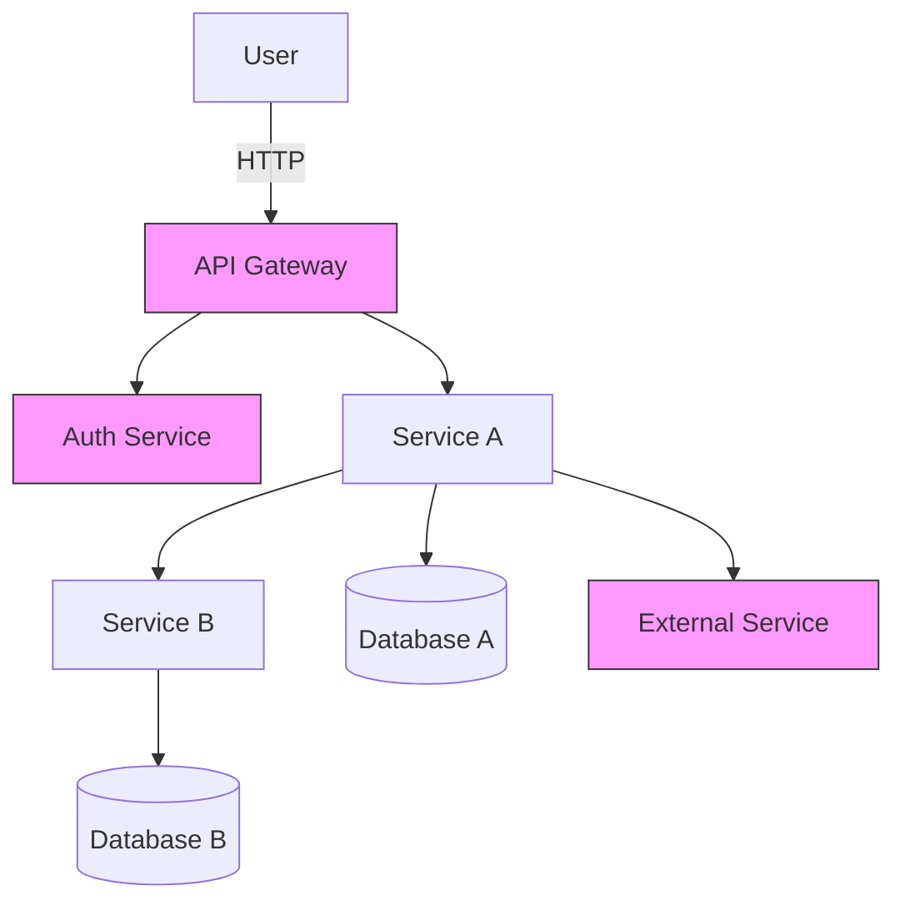

# MicroServicesProject

## Flowchart (Mermaid)

```mermaid
flowchart TD
  User[User] -->|HTTP| API_GW[API Gateway]
  API_GW --> Auth[Auth Service]
  API_GW --> ServiceA[Service A]
  ServiceA --> ServiceB[Service B]
  ServiceA --> DBA[(Database A)]
  ServiceB --> DBB[(Database B)]
  ServiceA --> External[External Service]
  classDef infra fill:#f9f,stroke:#333
  class API_GW,Auth,External infra
```

If GitHub does not render Mermaid, use the ASCII fallback:

User -> API Gateway -> Service A -> Service B -> Databases
